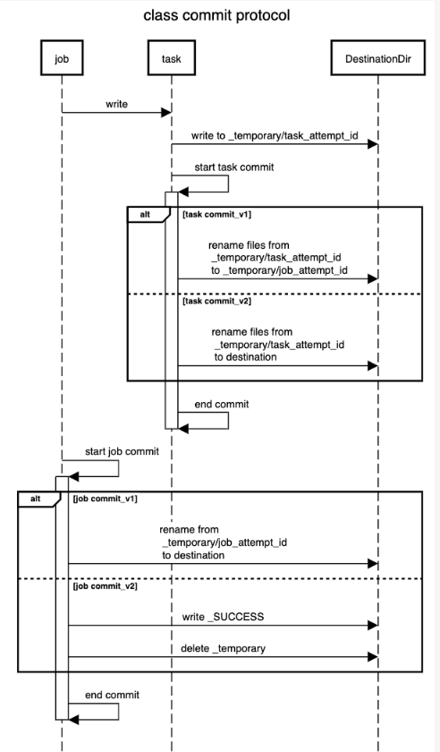

# OutputCommitter

Contents
1. Issues with standard Spark Output Committer
2. How S3A Committer solves those issues
3. S3A committers’ issue with ORC files
4. EMRFS S3-optimized committer


Terms
- `FileOutputFormatCommitter`: manages the commit of files created by single task to final output of a query.
- `S3A Committer`: new committer which can commit work directly to S3 where standard committer cannot do.
- hadoop-aws module and S3A filesystem client
- FileFormatWriter
- FileOutputCommitter
- SQLHadoopMapReduceCommitProtocol
- FileFormatDataWriter
  - `SingleDirectoryDataWriter` - bypass use of partitions and buckets

### Requirements for file system in order for Spark to commit task output
1. `Consistent listing`: 
   - When you list a directory, you see all the files which have been created in it, 
   - and no files which are not in it (i.e. have been deleted).
2. `Atomic rename`
    - No other process across the cluster may rename a file or directory to the same path.
    - If the rename fails for any reason, either the data is at the original location, or it is at the destination, in which case the rename actually succeeded.


In Hadoop, `FileOutputFormatCommitter` is responsible for managing the process
of promoting files created during a task attempt to final query output.
- handles failure of tasks and jobs
- supports speculative execution by listing dirs and renaming their content
to the final destination during commit phase.

What is speculative execution in Spark when writing output?

What are the risks of using classic `FileOutputCommitter` to commit work to S3?
- loss or corruption of generated data.

1. generating temp dir beneath dir of your final target.
2. creating new file for task in attempt_ dir.
3. commit if task succeeded via `commitTask(taskContext: TaskAttemptContext)`
   - renaming attempt_files into task_files be delegating to `SparkHadoopMapRedUtil.commitTask`
     - invoke `FileOutputCommitter.commitTask(TaskAttemptContext, Path taskAttemptPath)`

Issues with standard Spark output committer
1. Consistency and Atomicity: S3 does not provide strong consistency for listing files and renaming operations.
2. Multi-part uploads
3. Retries and Failures: `FileOutputCommitter` can lead to incomplete output.

What is the commit protocol on HDFS and similar file systems?



```
# sequencediagram.org

title class commit protocol

entryspacing 0.8
job->task: write
task->DestinationDir: write to _temporary/task_attempt_id
task->task: start task commit
activate task
alt task commit_v1
task->DestinationDir: rename files from\n _temporary/task_attempt_id\n to _temporary/job_attempt_id
else task commit_v2
task->DestinationDir: rename files from\n _temporary/task_attempt_id\n to destination
end
task->task: end commit
deactivate task

job->job: start job commit
activate job

alt job commit_v1
job->DestinationDir: rename from\n _temporary/job_attempt_id\n to destination
else job commit_v2
job->DestinationDir: write _SUCCESS
job->DestinationDir: delete _temporary
end

job->job: end commit
deactivate job
```


## [Best practices to optimize data access performance from Amazon EMR and AWS Glue to Amazon S3](https://aws.amazon.com/blogs/big-data/best-practices-to-optimize-data-access-performance-from-amazon-emr-and-aws-glue-to-amazon-s3/)

```
Previously, Amazon EMR used the s3n and s3a file systems. 
While both still work, we recommend that you use the s3 URI scheme 
for the best performance, security, and reliability.
```

- 3,500 PUT/COPY/POST/DELETE
- 5,500 GET/HEAD requests per second per prefix in a bucket
- best practices
  - Modify the retry strategy for Amazon S3 requests
  - Adjust the number of Amazon S3 objects processed
  - Adjust the number of concurrent Amazon S3 requests

`Practice 1`: Modify the retry strategy for Amazon S3 requests
- To access Amazon S3 data, both Amazon EMR and AWS Glue use the EMR File System (EMRFS), 
which retries Amazon S3 requests with jitters when it receives 503 Slow Down responses.
- Increase the EMRFS default retry limit
  - By default, EMRFS uses an exponential backoff strategy to retry requests to Amazon S3. 
  - The default EMRFS retry limit is 15
- to set Spark config in Glue `--conf spark.hadoop.fs.s3.maxRetries=20`

`Practice 2`: Adjust the number of Amazon S3 objects processed
- Preprocess the data by aggregating multiple smaller files into fewer, larger chunks. 
use s3-dist-cp or an AWS Glue compaction blueprint
- Use partition pruning to scan data under specific partitions


`Practice 3`: Adjust the number of concurrent Amazon S3 requests
- Reduce the number of Spark RDD partitions before writes.
- Use the EMRFS S3-optimized committer – The EMRFS S3-optimized committer is used by default in Amazon EMR 5.19.0 and later, and AWS Glue 3.0
- The committer uses Amazon S3 multipart uploads instead of renaming files, and it usually reduces the number of HEAD/LIST requests significantly.
- Reduce the number of concurrent jobs
- Reduce the number of concurrent Spark tasks

https://docs.aws.amazon.com/emr/latest/ManagementGuide/emr-fs.html
- If you turn on `Spark speculative execution` and write data to Amazon S3 using EMRFS direct write, 
you may experience `intermittent data loss`. 
- When you write data to HDFS, or write data in Parquet using the EMRFS S3-optimized committer, 
Amazon EMR does not use direct write and this issue does not occur.
- If you need to write data in formats that use EMRFS direct write from Spark to Amazon S3 and use speculative execution, 
we recommend writing to HDFS and then transferring output files to Amazon S3 using S3DistCP.
- Here are the requirements for the storage: S3 meets 1 and 3 now. But 2 is still missing.
  1. Atomic visibility: There must be a way for a file to be visible in its entirety or not visible at all. 
  2. Mutual exclusion: Only one writer must be able to create (or rename) a file at the final destination. 
  3. Consistent listing: Once a file has been written in a directory, all future listings for that directory must return that file.


## Ref
1. [delta-io AWS S3 consistency and speculative uploads](https://github.com/delta-io/delta/issues/645)
2. https://yousry.medium.com/spark-speculative-execution-in-10-lines-of-code-3c6e4815875b
3. AWS
   - https://docs.aws.amazon.com/emr/latest/ManagementGuide/emr-plan-upload-s3.html#Config_Multipart
   - https://docs.aws.amazon.com/emr/latest/ReleaseGuide/emr-spark-committer-multipart.html
   - https://repost.aws/questions/QUmVnZdR3KQ-60ugXxXLBPIg/emrfs-write-errors
   - https://docs.aws.amazon.com/emr/latest/ReleaseGuide/emr-fs.html
   - https://aws.amazon.com/blogs/big-data/improve-apache-spark-write-performance-on-apache-parquet-formats-with-the-emrfs-s3-optimized-committer/

4. https://stackoverflow.com/questions/46375631/setting-spark-speculation-in-spark-2-1-0-while-writing-to-s3
5. https://hadoop.apache.org/docs/current/hadoop-aws/tools/hadoop-aws/committers.html
6. https://github.com/getmoto/moto/issues/1513
7. https://kb.databricks.com/clusters/multi-part-upload
8. https://docs.databricks.com/en/security/network/classic/s3-commit-service.html
9. https://yousry.medium.com/spark-speculative-execution-in-10-lines-of-code-3c6e4815875b


